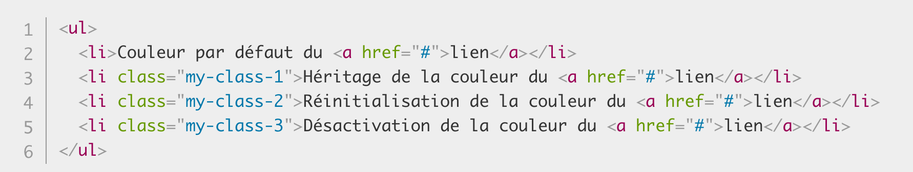
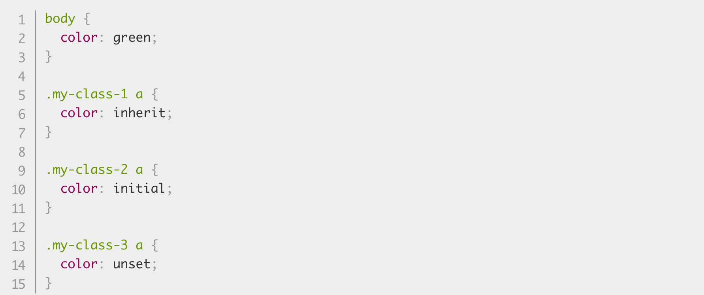

Bonjour à tous  :wave: .
On espère que vous allez bien :bangbang:

Aujourd'hui on va vous présenter :

<!-- CSS - Héritage (découverte et fonctionnement)-->
# **L'Héritage en CSS :**

<!-- Début des explications de l'Héritage CSS -->
Pour le CSS, l'**Héritage** est le dernier élément dont on a besoin pour comprendre quel style est appliqué à un élément, mais aussi pour obtenir toutes les informations nécéssaire à notre code.

Afin de comprendre le fonctionnement, il faut se mettre en tête qu'il y a un système de "*parents/enfants*", c'est d'ailleurs pour cela que l'on parle d'un élément d'**Héritage**.

Par exemple :

- Pour appliquer une police et/ou une couleur à tout notre code HTML, il est possible d'ajouter : *"font-family"* et *"color"*. Cela s'appliquera sur l'emsemble de notre page. On dit que ces attributs sont des **hérités**. 

A contrario :

- Les attributs : *"margin"*, *"padding"* et *"border"* ne sont pas des hérités.
<!-- Fin des explications -->

<!-- Début du fonctionnement -->
# **Contrôle de l'Héritage :**

Il existe **quatres valeurs de propriétés universelles spéciales** pour contrôler l'*Héritage* sur CSS :

1. **inherit** = C'est ce qui indique la valeur de propriété appliquée à l'élément sélectionné est la même que celle de l'élément parent.

2. **initial** = Indique que la valeur de propriété appliquée à l'élément sélectionné est la même que celle définie pour cet élément dans la feuille de style par défaut du navigateur.

3. **unset** = Reset la propriété à sa valeur naturelle, ce qui signifie que si la propriété est naturellement héritée, elle se comporte comme inherit, autrement elle agit comme initial.

4. **revert** = Rétablit la propriété à la valeur qu'elle aurait eue si aucun style ne lui avait été appliqué.

Parmi ces valeurs, "**inherit**" est pour la plus plupart du temps, là plus intéressante. Elle permet de faire en sorte qu'*un élément hérite explicitement d'une valeur de propriété de son parent*.

* **Voici le code HTML pour exemple :**



* **Exemple du code CSS :**



* **Résultat obtenu :**


<!-- Fin du fonctionnement -->

# La cascade et ses règles
 
Nous avons vu dans l'article précédent ( écrit par Ahamad) la notion d'héritage (les éléments prenant des valeurs de propriété de leurs parents et pas d'autres). Cette article va traiter d'un autre mécanisme importante du CSS : la cascade.
Lors de l'écriture d'une feuille de style, vous allez souvent attribuer à un élément plusieurs sélecteurs.
Comment savoir quelles règles s'appliquent finalement à cet élément?  
 Imaginons que je veus repeindre ma chambre (c'est mon élément ex: body) en bleu.  
```
body {  
backgroud-color:blue;  
}  
```   
Puis de peintre en rose seulement les plinthes, et le pourtour des fenêtres en violet.  
```  
.plinthes {  
background-color:pink;  
}  
.fenêtres {  
background-color:purple;  
}  
```  
Quelles couleurs va primer sur ma chambre au final?  
  
Pour éviter les conflits ( et une chambre trop bariolée :wink:), le mécanisme de la cascade pose plusieurs règles pour imposer un style.
Avant toute action pour résoudre un conflit, nous allons nous poser une série de questions par rapport à trois facteurs importants pouvant jouer sur la résolution de celui-ci (par ordre de priorité ):
 
1. L'importance  
2. La spécificité
3. L'ordre dans le source  

Imaginons que nous devons départager des personnes en désaccord, on va se poser plusieurs questions pour trancher la discussion: 
 
1. Es-que la source du conflit vient d'une personne en particulier? (l'importance de l'origine)  
2. Sur quoi ces personnes sont en désaccord? (la spécificité des sélecteurs)
3. "le dernier qui a parlé à raison" (l'ordre dans la source) 
