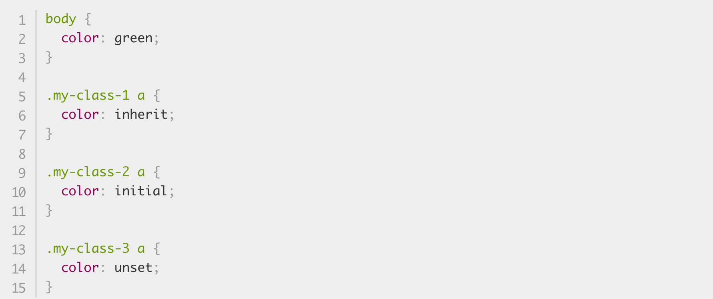
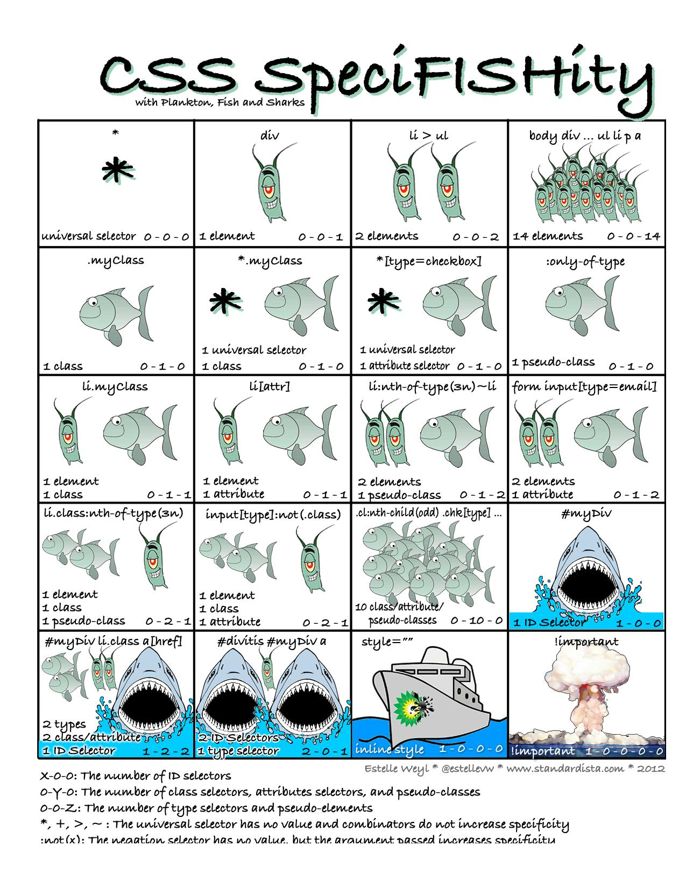

Bonjour à tous  :wave: .
On espère que vous allez bien :bangbang:

Aujourd'hui on va vous présenter :

<!-- CSS - Héritage (découverte et fonctionnement)-->
# **L'Héritage en CSS :**

<!-- Début des explications de l'Héritage CSS -->
Pour le CSS, l'**Héritage** est le dernier élément dont on a besoin pour comprendre quel style est appliqué à un élément, mais aussi pour obtenir toutes les informations nécéssaire à notre code.

Afin de comprendre le fonctionnement, il faut se mettre en tête qu'il y a un système de "*parents/enfants*", c'est d'ailleurs pour cela que l'on parle d'un élément d'**Héritage**.

Par exemple :

- Pour appliquer une police et/ou une couleur à tout notre code HTML, il est possible d'ajouter : *"font-family"* et *"color"*. Cela s'appliquera sur l'emsemble de notre page. On dit que ces attributs sont des **hérités**. 

A contrario :

- Les attributs : *"margin"*, *"padding"* et *"border"* ne sont pas des hérités.
<!-- Fin des explications -->

<!-- Début du fonctionnement -->
# **Contrôle de l'Héritage :**

Il existe **quatres valeurs de propriétés universelles spéciales** pour contrôler l'*Héritage* sur CSS :

1. **inherit** = C'est ce qui indique la valeur de propriété appliquée à l'élément sélectionné est la même que celle de l'élément parent.

2. **initial** = Indique que la valeur de propriété appliquée à l'élément sélectionné est la même que celle définie pour cet élément dans la feuille de style par défaut du navigateur.

3. **unset** = Reset la propriété à sa valeur naturelle, ce qui signifie que si la propriété est naturellement héritée, elle se comporte comme inherit, autrement elle agit comme initial.

4. **revert** = Rétablit la propriété à la valeur qu'elle aurait eue si aucun style ne lui avait été appliqué.

Parmi ces valeurs, "**inherit**" est pour la plus plupart du temps, là plus intéressante. Elle permet de faire en sorte qu'*un élément hérite explicitement d'une valeur de propriété de son parent*.

* **Voici le code HTML pour exemple :**


* **Exemple du code CSS :**



* **Résultat obtenu :**


<!-- Fin du fonctionnement -->

# La cascade et ses règles  
  

source:https://blog.logrocket.com/how-css-works-understanding-the-cascade-d181cd89a4d8/
 
Nous avons vu dans l'article précédent ( écrit par Ahamad) la notion d'héritage (les éléments prenant des valeurs de propriété de leurs parents et pas d'autres). Cette article va traiter d'un autre mécanisme importante du CSS : la cascade.
L'idée est que toute propriété appliqué à un élément va s'étendre aussi à ces éléménts enfants (voir ).
Lors de l'écriture d'une feuille de style, vous allez souvent attribuer à un élément plusieurs sélecteurs.
Comment savoir quelles règles s'appliquent finalement à cet élément? 
 Imaginons que je veux repeindre ma chambre (c'est mon élément ex: article) en bleu. Puis de peintre en rose seulement les plinthes, et le pourtour des fenêtres en violet. 

 ```  
 <article class="plinthes">"je vais peindre ma chambre en bleu et violet</article>  
 <p id="fenêtres"> et mes fenêtres en rose </p>  
   
   #fenêtres {
   background-color: pink;
   }  
   
   .plinthes {
   background-color: purple;
   }  
   
   article{
   background-color: blue;
   }
   ```
  
Quelle couleur va primer sur les autres dans ma chambre au final? 
  
Pour éviter les conflits ( et une chambre trop bariolée :wink:), le mécanisme de la cascade pose plusieurs règles pour imposer un style.
Avant toute action pour résoudre un conflit, nous allons nous poser une série de questions par rapport à trois facteurs importants pouvant jouer sur la résolution de celui-ci (par ordre de priorité ):
 
1. L'importance  
2. La spécificité
3. L'ordre dans le source  

Imaginons que nous devons départager des personnes en désaccord, on va se poser plusieurs questions pour trancher la discussion: 
 
1. Es-que la source du conflit vient d'une personne en particulier? (l'importance )  
2. Sur quoi ces personnes sont en désaccord? (la spécificité des sélecteurs)
3. "le dernier qui a parlé à raison" (l'ordre dans la source) 

## 1ère règle : l'importance
  
Plusieurs entités peu intervenir pour imposer une priorité sur sa feuille de style (par ordre du plus faible en poid au plus important):  

1. l'agent user : Les paramètres de navigateur par défaut
2.  l' user : l'internaute voulant changer des paramètres pour son confort
3.  l'author : le développeur 
4. l' author``!important``
5. L'user ``!important``  
  
:heavy_exclamation_mark:  la déclaration ``!important`` placé à la suite de la valeur déclare la priorité sur toute les autres déclarations (à utiliser très rarement car change la cascade naturelle du code).  
  
## 2ème règle : la spécificité des sélecteurs  
  
si le conflit ne réside pas dans l'importance alors cela peut venir de deux sélecteurs qui appliquent chacun un style à un élèment.  
On va regarder la spécificité des sélecteurs pour faciliter le choix.  
Chaque sélecteur a une place dans la hiérarchie de la spécificité évalué par un poids différent selon qu'il soit un ID, une classe ou un simple élément. 
Pour connaître le niveau du sélecteur on impose une codification à 4 chiffres.  
Il existe quatre catégories distinctes qui définissent le niveau de spécificité d'un sélecteur donné (du plus "lourd" au moins important): 

1. Le Code "1 0 0 0 " : Le inline style (présence du style dans le document et non dans la feuille CSS).
Un style inline est situé à l'intérieur de votre document XHTML. Il est rattaché directement à l'élément à styliser. Par exemple <h1 style="color: #fff;"> 

2. Le code "0 1 0 0 " : L' ID est un identifiant pour les éléments de vos pages (ex: #fenêtres)

3. Le code "0 0 1 0 " :Les classes, attributs et pseudo-classes.Ce groupe comprend les .classes, [attributes] et les pseudo-classes (ex: .plinthes)

4. Le code "0 0 0 1" Les éléments et pseudo-éléments.(ex: article).

ex:   

source : https://www.damienflandrin.fr/blog/post/la-specificite-des-selecteurs-css
 
Après comparaison des valeurs des sélecteurs, nous pouvons connaître ainsi celui qui emporte la priorité sur l'autre.

Une petite illustration pourra mieux vous aider à comprendre :  

  
   
## 3ème règle : l'ordre  
  
Si après avoir questionner les deux précédentes règles nous ne trouvons pas la source du conflit, on se réfère à la règle de l'ordre.
Les dernières déclarations ont priorité sur celles antérieures.
