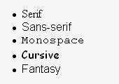

Bonjour à tous  :wave: .
On espère que vous allez bien :bangbang:

Aujourd'hui on va vous présenter :

**Comment manipuler les polices en CSS.**

Mais tout d'abord, il est important de bien choisir la police utilisée sur une page web. Car si la police est mal adaptée, moche, peu visible, ça ne donne pas envie de lire le site, quel que soit le contenu ou la qualité de celui-ci.

Au délà de l’aspect esthétique, il est facile d’oublier que tout a une signification, 
notamment quand il s’agit de visuel. 
Le choix de la typographie doit être réfléchi car il participera à la compréhension du message que vous voulez transmettre. Bref c'est vraiment important!


**Notions à savoir avant toutes choses**

Avant de choisir ses polices pour sa page web, il faut savoir que des contraintes existent:

* Il y a des ordinateurs ou des polices n'existent pas. Du coup, si une personne sur son ordinateur ne dispose pas de votre police, une autre s'affichera par défaut et ça tue tout votre design.
* Attention  :sos: , les Mac et PC n'ont pas toujours les mêmes noms pour les polices, ni la même résolution. 

Du coup, bien checker les équivalences entre Mac et PC.
* Enfin, il y a des navigateurs qui ne rendent pas la police de la même façon. 
Du coup,n'espèrez pas le même rendu partout.

Maintenant qu'on vous a bien dégoûté ... On vas voir comment gérer tous les problèmes ensemble. :bangbang: :bangbang:

Et on commence par le meilleur des moments..

# **_Font-Family_** :

Les familles de polices se déclarent à l'aide de le propriété `font-family`, à déclarer dans la balise `body` pour que toute la page puisse avoir la même écriture (c'est la notion d'*héritage*, nous verrons ceci dans un prochain article).

`font-family` peut prendre 2 valeurs possibles :

1. La police générique
2. Une police choisie par vos soins via [Google fonts.](https://fonts.google.com/)

Il est possible de voir d'autres sites pour trouver des fonts mais on travaille sur google fonts du coup grosse promo sur google. :satisfied:

Mais sachez qu’il en existe beaucoup d’autres et que souvent de nouvelles arrivent sur le marché…
toujours dans le but d’améliorer l’esthétisme visuel…

Si vous souhaitez augmenter votre catalogue de polices css, vous avez tout à fait la possibilité d’en récolter d’autres, voici quelques exemples de sites:

* [1001 Free Fonts.](https://www.1001freefonts.com/)
* [Font Squirrel.](https://www.fontsquirrel.com/)
* [Dafont.](https://www.dafont.com/fr/)
* [Font Library.](https://fontlibrary.org/)

Maintenant c'est à vous de choisir :wink:


## **_Polices génériques_** :

Il y a 5 famille de polices, dites "génériques" :

* **Sérif**
* **Sans-Sérif**
* **Monospace**
* **Cursive**
* **Fantasy**

Comme on l'a dit ci-dessus, il y a différents visus pour les navigateurs, voici un aperçu sur 4 navigateurs différents:

1. Avec firefox : 
2. Avec Microsoft Internet Explorer 7 : 
3. Avec Opéra : 
4. Avec Mac : 

On voit qu'il y a peu de différences avec les familles Sérif, Sans-Sérif et Monospace, Cursive est différent sur Mac par rapport au PC. Quant à Fantasy, pas la peine de dire plus, son nom parle pour lui.

:bowtie: Conseil : :bowtie: On préconise de rester focus sur les familles **Sérif** et **Sans-Sérif**. Mention spéciale pour Sans-Sérif qui est pour nous le plus "propre.

## **_Polices choisi par vos soins_** :

Ils existent tellement de polices qu'on ne pourrait pas en faire la liste , c'est pourquoi [Google fonts](https://fonts.google.com/) est votre meilleur ami, il vas vous permettre de réussir à trouver de nouveaux fontes pour votre page web.
Nous verrons par la suite comment les utiliser dans votre css.

Si on met un nom de famille, c'est bien de mettre plusieurs noms à côtés pour avoir des alternatives. C'est-à-dire si l'ordinateur ne liste pas correctement, il pourra se rabattre sur la seconde police , etc...

# **_Font-Size_** :

Les tailles de votre police se déclarent à l'aide de la propriété `font-size`.

`font-size` peut prendre plusieurs valeurs possibles :

* xx-large
* x-large
* larger
* large
* medium
* small
* smaller
* x-small
* xx-small
* length (longueur)
* %/em/rem/px

Beaucoup de valeurs mais pas besoin d'expliquer leurs effets , leurs noms parlent d'eux même.

# **_Font-style_** :

La police peut se mettre en italique ou oblique à l'aide de la propriété `font-style`.

`font-style` peut prendre 3 valeurs possibles :

1. normal
2. italic
3. oblique

## **_Normal_** :

Cela prend une police dit `normale` parmi celles de `font-family`.

## **_Italic_** :

Cela prend une police `italic` , la forme est généralement une forme curvise qui utilise moins d'espace horizontal que les autres formes.

## **_Oblique_** :

Cela prend une police `oblique`, la forme est juste une version "penchée" du `normal`. Mais la police `oblique` peut contenir un angle ( en degrès) pour définir la pente du texte ( l'angle est compris entre `-90 deg` et `90 deg` ). Si aucun angle n'est mis , la pente est automatiquement mise à `14 deg`

# **_Font-Variant_** :

Les variantes de police se déclarent avec la propriété `font-variant`.

`font-variant` peut prendre plusieurs valeurs, mais on vas se concentrer sur deux basiques pour l'instant :

1. normal
2. small-caps ( sert à afficher en petites capitales )

# **_Font-weight_** :

Les graisses de la police se déclarent avec la propriété `font-weight`.

`font-weight` peut prendre plusieurs valeurs :

* lighter (on diminue la graisse , du coup le texte paraît plus fin)
* normal (équivaut à la valeur 400)
* 1/100/500 (n'importe quel chiffre entre 1 et 1000)
* bold (équivaut en gras, valeur égale à 700)
* bolder (encore plus gras)

Enfin , on vas voir une dernière partie mais non des moindre,

# **_Comment intégrer des ploices externes dans le CSS_** :

2 choix possibles :

1. Méthode Standard
2. @import

## **_Méthode Standard_** :

Au niveau de votre document HTML, il faut écrire dans votre `<head>` :

```
<link href="url de votre police sur google fonts" rel="stylesheet">
```

Puis dans votre document CSS :

```
font-family: 'nom de votre police', nom de la famille générique;
```

## **_@import_** :

AU niveau de votre document HTML, il faut écrire dans votre `<head>` :

```
<style>
@import url('url de votre police sur google fonts');
</style> 
```

Puis dans votre document CSS :

```
font-family: 'nom de votre police', nom de la famille générique;
```

Nous venons de conclure notre article sur la police en CSS.
On espère que ça vous a aidé à comprendre ou à découvrir ceci. :smile:

Toute la Team vous remercie. :wave:


Amandine, Céline, Louis, Ahmad et Antoine.

:point_right: [Article Suivant : Cascade et Héritage en CSS](HTML-CSS/Article_CSS/Article_Héritage&Cascade_CSS/heritage&cascade.md) :point_left: