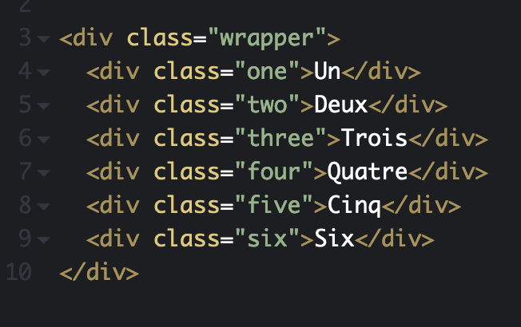
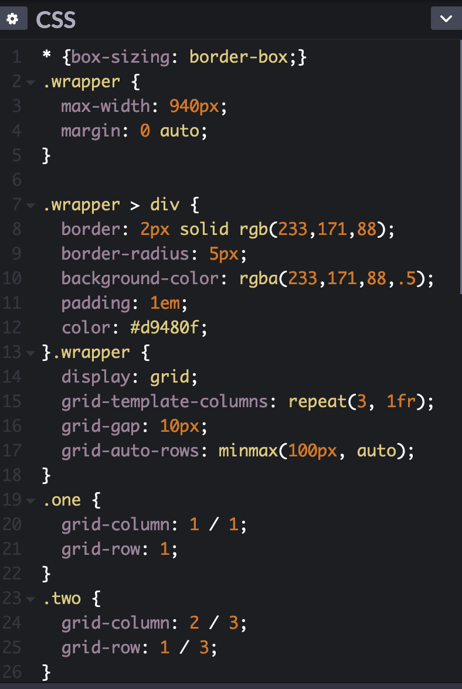
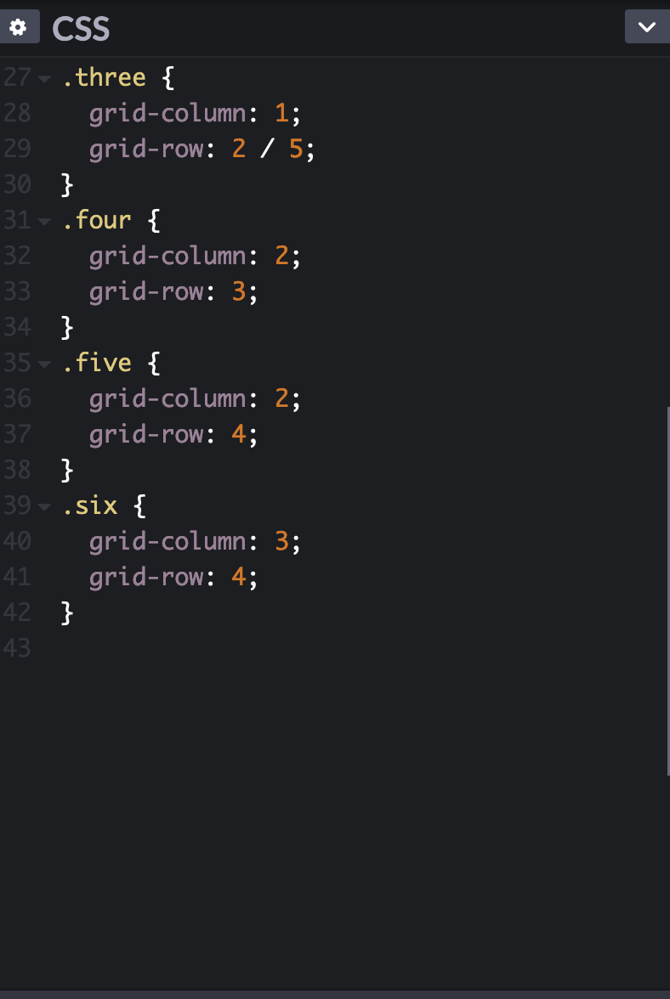

# **Responsive CSS**

Connaissez vous la première intérogation des developpeurs web à notre époque ?

C'est de savoir comment faire pour que leur site s'adapte automatiquement à tout les types d'ecrans. Car oui aujourd'hui les sites internet son consultable depuis un téléphone ou une tablette en plus d'un ordinateur.

C'est pour ça que le responsive existe.

# **Flexbox**

# **CSS Grid**

La dernière et nouvelle façon de créer un site web responsive de nos jours (pour le moment) s'appelle **CSS Grid**.

Pour commencer, qu'est-ce-que `CSS Grid`?

- C'est une manière "nouvelle" de mettre en page le squelette de son futur site web/sa future page web. Il permet de placer des blocs plus facilement, avec de simples commandes.

_"Hein j'ai pas compris votre charabia là..."_ :sweat_smile:

No stress, on va vous montrer comment cela fonctionne.
D'abord les images, puis les commandes. Histoire que vous ne soyez pas trop perdu(e)s !  :stuck_out_tongue_winking_eye:

- Voici une illustrations de ce que vous pouvez faire grâce au **CSS Grid** :

_"Cool être cette illu ? Aimer, ce genre de chose !"_ - Maître Yoda  :trollface:

- Par la suite, le code `HTML`:

- C'est là que ça devient intéressant, voici le code `CSS` :

