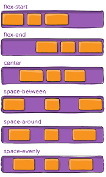
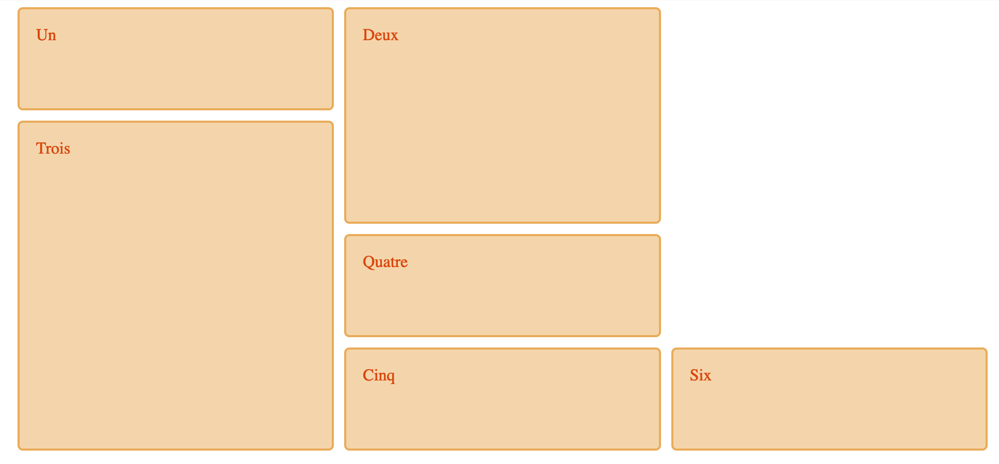
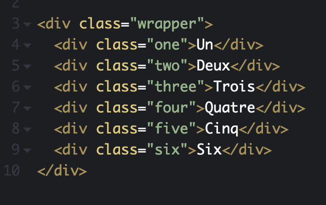
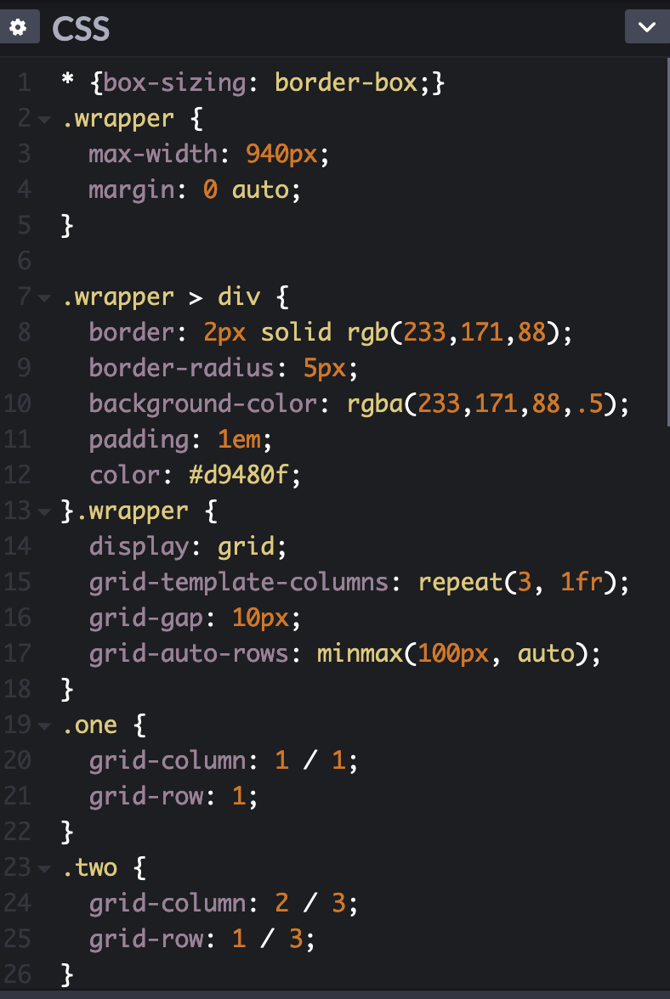
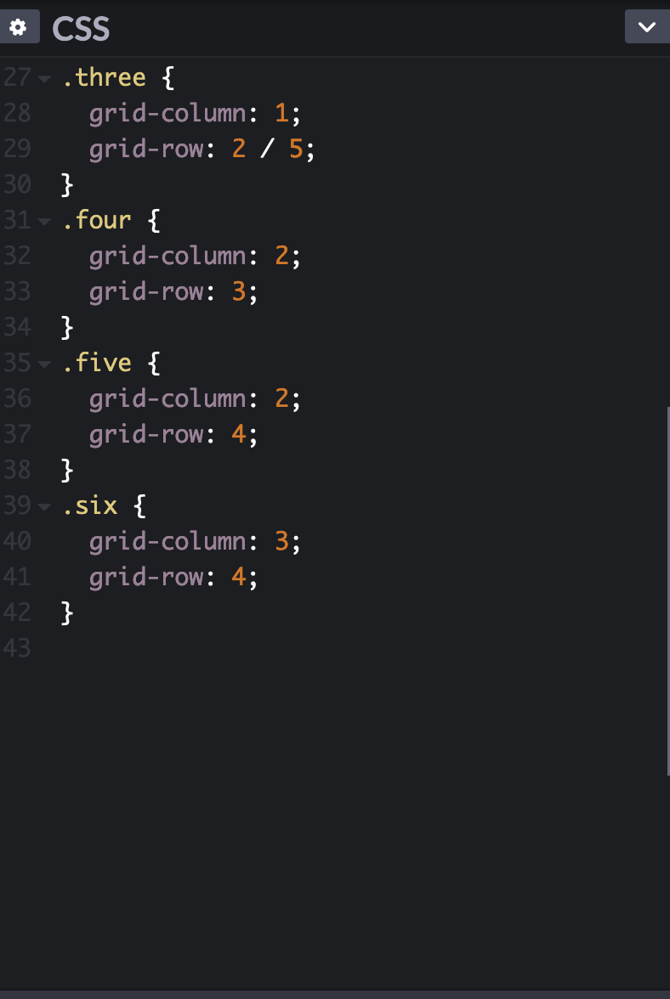

# **Responsive CSS**

Connaissez vous la première intérrogation des développeurs web à notre époque ?

C'est de savoir comment faire pour que leur site s'adapte automatiquement à tout les types d'ecrans. Car oui aujourd'hui les sites internet sont consultables depuis un téléphone ou une tablette en plus d'un ordinateur.

C'est pour ça que le responsive existe.

Et pour ça il existe plusieurs moyens mais pour l'instant nous en verrons 2 qui sont les plus courants.

# **Flexbox**

La première façon de créer un site web responsive s'appelle le **Flexbox**

Avant de commencer on va voir ce qu'est le Flexbox.

Le Flexbox est un outil de disposition des éléments dans une page web. Il permet d'avoir un design adaptatif à l'écran. Les éléments peuvent être réagencés selon que l'on est sur un téléphone portable ou un écran d'ordinateur.

Mais comment Marche le flexbox ? Commencez par regarder ce schéma, je suis sûr que vous allez déjà y voir plus clair.

Vous voyez c'est déja un peu plus clair.  :stuck_out_tongue_winking_eye:

Maintenant pour que vous compreniez encore mieux on va vous montrer ce que cela donne directement dans un code CSS.

Bon d'accord, c'est plus un jeu qu'une ligne de code mais bon cela peut vous permettre d'apprendre de manière ludique :trollface:

# **CSS Grid**

La dernière et nouvelle façon de créer un site web responsive de nos jours (pour le moment) s'appelle **CSS Grid**.

Pour commencer, qu'est-ce-que `CSS Grid`?

- C'est une manière "nouvelle" de mettre en page le squelette de son futur site web/sa future page web. Il permet de placer des blocs plus facilement, avec de simples commandes.

_"Hein j'ai pas compris votre charabia là..."_ :sweat_smile:

No stress, on va vous montrer comment cela fonctionne.
D'abord les images, puis les commandes. Histoire que vous ne soyez pas trop perdu(e)s !  :stuck_out_tongue_winking_eye:

- Voici une illustrations de ce que vous pouvez faire grâce au **CSS Grid** :

_"Cool être cette illu ? Aimer, ce genre de chose !"_ - Maître Yoda  :trollface:

- Par la suite, le code `HTML`:

- C'est là que ça devient intéressant, voici le code `CSS` :

