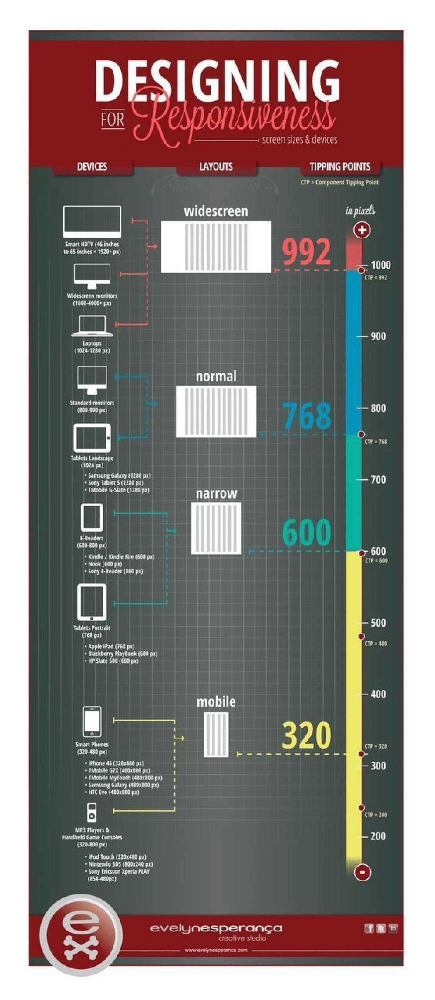

# Responsive CSS:

Connaissez vous la première interrogation des développeurs web à notre époque ?

C'est de savoir comment faire pour que leur site s'adapte automatiquement à tout les types d'ecrans.

Car oui aujourd'hui les sites internet sont consultables depuis un téléphone ou une tablette en plus d'un ordinateur.

À savoir que pour chaque écran il y a sa résolution, il y a un donc un minimum et un maximum à définir pour que notre site s'adapte en fonction de celle-ci, ci-dessous un petit extrait des tailles ont indiqué en fonction du type d'écran.

C'est pour ça que le responsive existe.

Et pour ça il existe plusieurs moyens mais pour l'instant nous en verrons 2 qui sont les plus courants.

# Utiliser la balise meta viewport pour contrôler la mise en page sur les navigateurs mobiles:

Les nouvelles fonctionnalités de la version à venir de Firefox Mobile (Fennec), 1.1, ont amélioré le support pour la balise <meta name="viewport">. Les versions précédentes supportaient les propriétés width, height, et initial-scale de la balise viewport, mais étaient problématiques avec certains sites prévus pour les navigateurs iPhone et Android. Nous supportons désormais les mêmes propriétés que Safari Mobile, et nous avons également amélioré Fennec pour permettre au rendu d'être plus cohérent entre les différentes tailles et résolutions d'écrans.

# Tailles communes de viewport pour les périphériques mobiles et tablettes:

Si vous souhaitez connaître les largeurs de viewport des périphériques mobiles et tablettes les plus communs,Elle vous donnera des informations telles que la largeur du viewport en orientation portrait et paysage, ainsi que la taille physique de l'écran, le système d'exploitation et la résolution du périphérique.

# Les media queries :

**screen** => Écrans
**handheld** =>Périphériques mobiles ou de petite taille
**print** =>Impression
**braille** => Plages braille
**projection** => Projecteurs (ou présentations avec slides)
**tty** =>Terminal/police à pas fixe
**tv** =>Téléviseur
**all** =>Tous les précédents

# print : 
Ces directives peuvent parfaitement être intégrées au sein même d'une feuille de style grâce à une règle @media suivie directement du type. La syntaxe sera alors légèrement différente :

Note : d'autres variantes peuvent exister avec la règle @import, cependant celle-ci pose quelques problèmes de performance sur d'anciens navigateurs et se voit ignorée lorsqu'elle est utilisée en combinaison avec les media queries sur Internet Explorer versions inférieures à 8. Ce point ne sera donc pas approfondi ici.

# Logical opirators:

#And:
Pour obtenir l'équivalent du "ou", il suffit d'énumérer différentes media queries à la suite, séparées par des virgules : si l'une d'entre elles est valable, alors l'ensemble de la règle sera appliquée.

En général, on combine ensemble un type de média (screen, all...) et une expression grâce à and, bien qu'une expression seule puisse être utilisée. L'expression est toujours écrite entre parenthèses.

Les deux exemples suivants ciblent les écrans de largeur inférieure à 640 pixels grâce à la règle max-width associée à la valeur 640px.

#not only:

# Fonctionnalités:

![min-max] (../yassinebelaid/Pictures/min-max.png)

La plupart des critères (ou fonctionnalités) peuvent être préfixés par min- et max- lorsqu'elles acceptent des valeurs numériques pour définir des valeurs minimales ou maximales à respecter.

**color :** support de la couleur (bits/pixel)
**color-index :** périphérique utilisant une table de couleurs indexées
**device-aspect-ratio :** ratio du périphérique de sortie (par exemple 16/9)
**aspect-ratio :** ratio de la zone d'affichage
**device-height :** dimension en hauteur du périphérique
**device-width :** dimension en largeur du périphérique
**grid :** périphérique bitmap ou grille (ex : lcd)
**height :** dimension en hauteur de la zone d'affichage
**monochrome :** périphérique monochrome ou niveaux de gris (bits/pixel)
**orientation :** orientation du périphérique (portrait ou landscape)
**resolution :** résolution du périphérique (en dpi, dppx, ou dpcm)
**scan :** type de balayage des téléviseurs (progressive ou interlace)
**width :**dimension en largeur de la zone d'affichage

Les dimensions pourront être évaluées avec des unités (px, em). Les ratio avec des fractions (entier/entier). Une résolution sera définie en dpi (points par pouce) ou en dpcm (points par centimètres).

Certaines de ces propriétés peuvent être testées d'une façon raccourcie sans valeur, par exemple (color) qui sera équivalent à (min-color: 1) ou considérée comme vraie pour une valeur différente de 0. La fonctionnalité monochrome n'est pas uniquement booléenne avec la syntaxe raccourcie (monochrome), on peut aussi considérer un nombre de niveaux de gris, par exemple (min-monochrome: 2) pour 2 bits par pixel.

# Mobile first :

![mob] (../yassinebelaid/Pictures/mob.png)

#langage HTML Flexible et Dynamique de l’adaptation des Éléments Mobiles:
Fonctionnement : Un algorithme qui prend en compte l’ordre des éléments de la page sur la version PC et les réorganise en fonction de la logique prédéterminée de la page mobile. Les modifications personnalisées d'ordre logique sont autorisées pour l’affichage mobile destinées à répondre aux besoins professionnels du webmaster (contrairement aux sites web responsifs non modifiables) - ce qui réduit suffisamment le processus de transfert en général. Pourquoi est-ce nécessaire ? Réduit le temps et les coûts pour mettre à jour la version mobile.

#Mise en forme des espaces durant l’adaptation de la version PC en version mobile :
Fonctionnement : Un algorithme pour nettoyer les espaces inutiles qui existent à des fins de design unique sur la version PC. Partant de l’approche du design Mobile first, ces espaces sont nuisibles (par exemple, un espace latéral de 300 px prévu pour un écran d’ordinateur de bureau 1920x1080 rendrait illisibles les éléments d’un smartphone 360x640).

#Utilisation des polices du web pour obtenir le même résultat sur différents navigateurs:
Fonctionnement : Utilisation d’un ensemble téléchargeable de polices web formatées de manière identique pour tous les navigateurs et appareils (WOFF2, WO Utilisation des polices du web pour obtenir le même résultat sur différents navigateurs.

![mobf] (../yassinebelaid/Pictures/mobf.png)

#Media queries level 4 :

Les entités multimédias de type "plage" peuvent être écrites en alternance dans un contexte de plage tirant parti du fait que leurs valeurs sont ordonnées, à l'aide d'opérateurs de comparaison mathématiques ordinaires:

![med] (../yassinebelaid/Pictures/med.png)

**Remarque:** cette syntaxe est nouvelle pour le niveau 4 de Mediaqueries et n'est donc pas aussi largement prise en charge pour le moment que les préfixes min / max .

# Mixins media queries: 

Sass mixins nous donne la possibilité de créer des fragments de code réutilisables: ils réduisent la répétition, favorisent le code non crypté et permettent une maintenance aisée. Écrire des media queries sous forme de mixins à insérer dans vos feuilles de style.

/yassinebelaid/Pictures/respo.png

