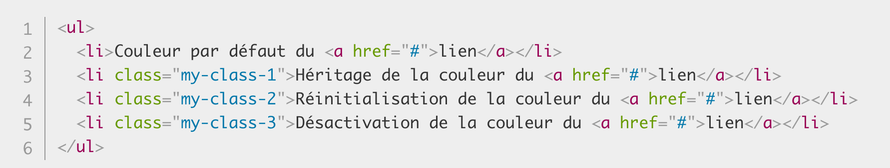

<!-- CSS - Héritage (découverte et fonctionnement)-->
# **L'Héritage en CSS :**

<!-- Début des explications de l'Héritage CSS -->
Pour le CSS, l'**Héritage** est le dernier élément dont on a besoin pour comprendre quel style est appliqué à un élément, mais aussi pour obtenir toutes les informations nécéssaire à notre code.

Afin de comprendre le fonctionnement, il faut se mettre en tête qu'il y a un système de "*parents/enfants*", c'est d'ailleurs pour cela que l'on parle d'un élément d'**Héritage**.

Par exemple :

- Pour appliquer une police et/ou une couleur à tout notre code HTML, il est possible d'ajouter : *"font-family"* et *"color"*. Cela s'appliquera sur l'emsemble de notre page. On dit que ces attributs sont des **hérités**. 

A contrario :

- Les attributs : *"margin"*, *"padding"* et *"border"* ne sont pas des hérités.
<!-- Fin des explications -->

<!-- Début du fonctionnement -->
# **Contrôle de l'Héritage :**

Il existe **quatres valeurs de propriétés universelles spéciales** pour contrôler l'*Héritage* sur CSS :

1. **inherit** = C'est ce qui indique la valeur de propriété appliquée à l'élément sélectionné est la même que celle de l'élément parent.

2. **initial** = Indique que la valeur de propriété appliquée à l'élément sélectionné est la même que celle définie pour cet élément dans la feuille de style par défaut du navigateur.

3. **unset** = Reset la propriété à sa valeur naturelle, ce qui signifie que si la propriété est naturellement héritée, elle se comporte comme inherit, autrement elle agit comme initial.

4. **revert** = Rétablit la propriété à la valeur qu'elle aurait eue si aucun style ne lui avait été appliqué.

Parmi ces valeurs, "**inherit**" est pour la plus plupart du temps, là plus intéressante. Elle permet de faire en sorte qu'*un élément hérite explicitement d'une valeur de propriété de son parent*.

* **Voici le code HTML pour exemple :**

* **Exemple du code CSS :**

* **Résultat obtenu :**

<!-- Fin du fonctionnement -->